# 📊 Diagramas C4 Visuales - Sistema de Gestión de Licitaciones y Presupuestos

> **✅ Este archivo se visualiza correctamente en GitHub**  
> Los diagramas Mermaid se renderizan automáticamente al abrir este archivo en GitHub.

---

## 📍 Nivel 1: Diagrama de Contexto

**¿Qué hace el sistema y quién lo usa?**

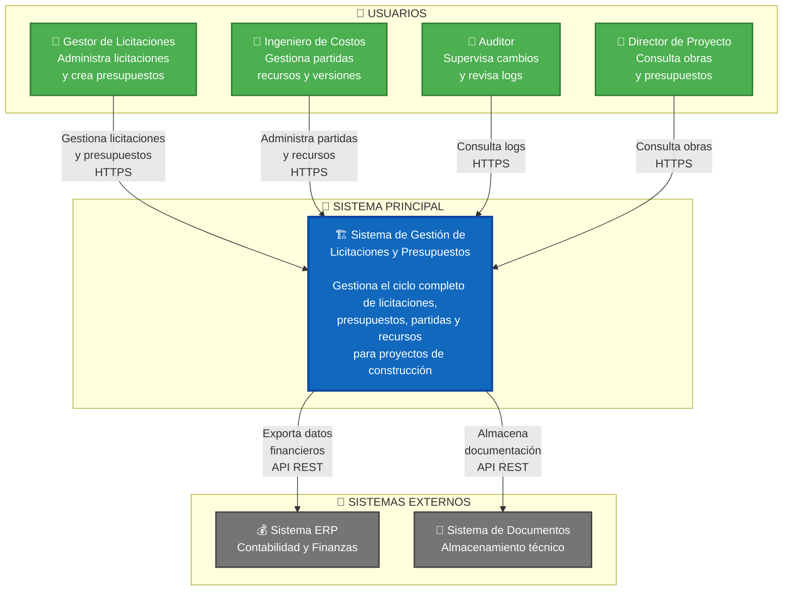

### 📝 Descripción Nivel 1
- **Sistema Central**: Gestiona licitaciones, presupuestos, partidas y recursos
- **4 Tipos de Usuarios**: Cada uno con roles y permisos específicos
- **Integración Externa**: Conecta con ERP para finanzas y sistema documental

---

## 🏗️ Nivel 2: Diagrama de Contenedores

**¿Cuáles son las piezas principales del sistema?**

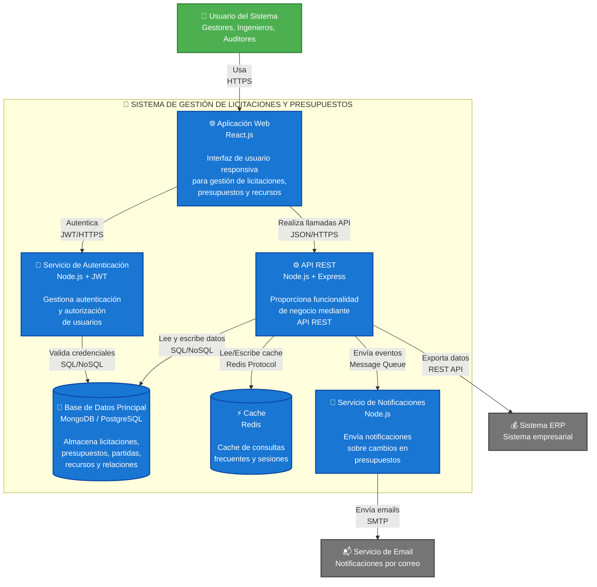

### 📝 Descripción Nivel 2
- **Frontend**: Aplicación web en React.js
- **Backend**: API REST con Node.js/Express
- **Autenticación**: JWT para seguridad
- **Persistencia**: Base de datos + Cache Redis
- **Notificaciones**: Sistema asíncrono de alertas

---

## ⚙️ Nivel 3: Diagrama de Componentes (Backend API)

**¿Cómo está organizado internamente el backend?**

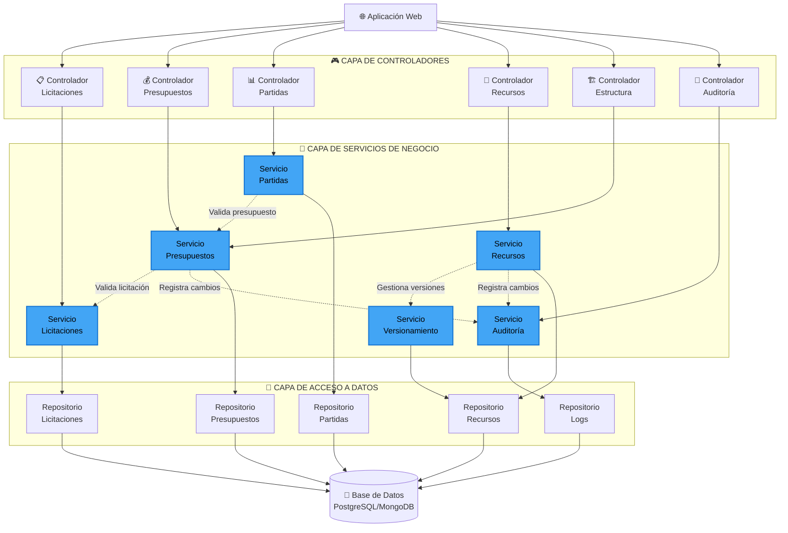

### 📝 Descripción Nivel 3
**Arquitectura en 3 Capas:**
1. **Controladores**: Manejan peticiones HTTP
2. **Servicios**: Contienen lógica de negocio
3. **Repositorios**: Acceso a base de datos

**Patrones Implementados:**
- ✅ Controller Pattern
- ✅ Service Layer Pattern  
- ✅ Repository Pattern
- ✅ Dependency Injection

---

## 🗃️ Modelo de Dominio - Entidades Principales

**Relaciones entre entidades del sistema**

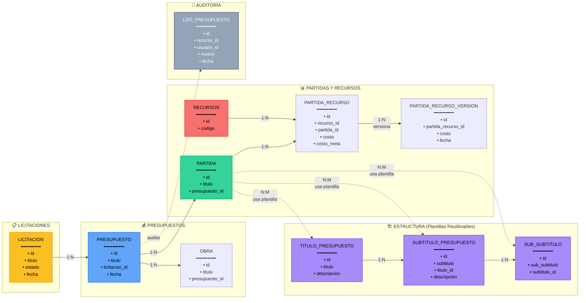

### 📝 Descripción del Modelo
**Entidades Clave:**
- 🟡 **Licitaciones**: Punto de partida del proceso
- 🔵 **Presupuestos**: Asociados a licitaciones, contienen partidas
- 🟣 **Estructura**: Plantillas reutilizables (títulos, subtítulos)
- 🟢 **Partidas**: Componentes del presupuesto con estructura
- 🔴 **Recursos**: Materiales/servicios con versionamiento de costos
- ⚫ **Logs**: Auditoría completa de cambios

---

## 🔄 Flujo de Datos Principal

**Secuencia típica de creación de presupuesto con partidas**

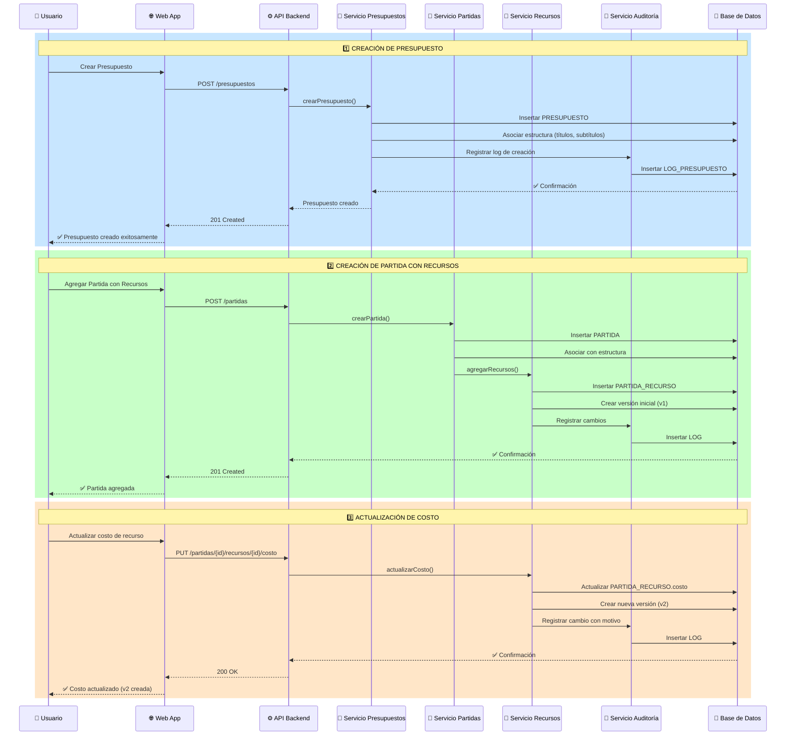

### 📝 Descripción del Flujo
1. **Fase 1**: Usuario crea presupuesto y asocia estructura
2. **Fase 2**: Se agregan partidas con recursos iniciales (versión 1)
3. **Fase 3**: Actualizaciones de costos generan nuevas versiones
4. **Auditoría**: Cada operación se registra en LOG_PRESUPUESTO

---

## 🎯 Conceptos Arquitectónicos Clave

### 1. 🔄 Sistema de Plantillas (Template Pattern)

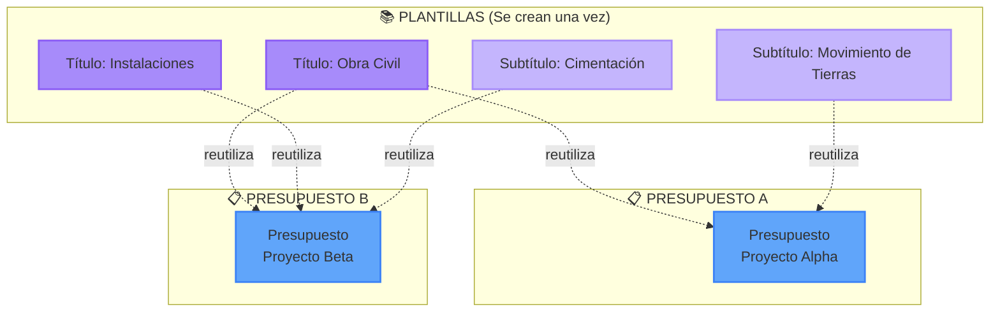

**Ventajas:**
- ✅ No duplicación de datos
- ✅ Consistencia en toda la organización
- ✅ Fácil actualización centralizada
- ✅ Reutilización máxima

### 2. 📦 Sistema de Versionamiento

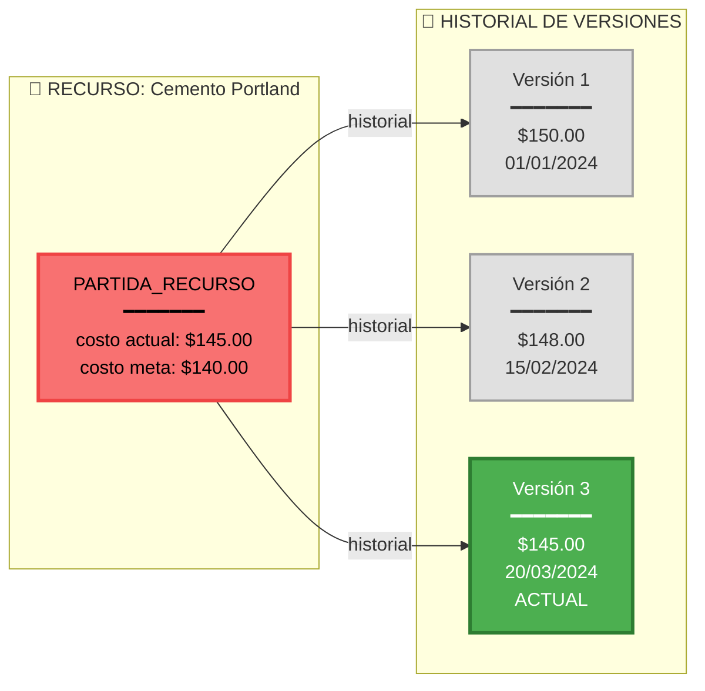

**Ventajas:**
- ✅ Trazabilidad completa
- ✅ Auditoría de cambios
- ✅ Análisis de tendencias
- ✅ Rollback si es necesario

### 3. 📋 Auditoría Integral

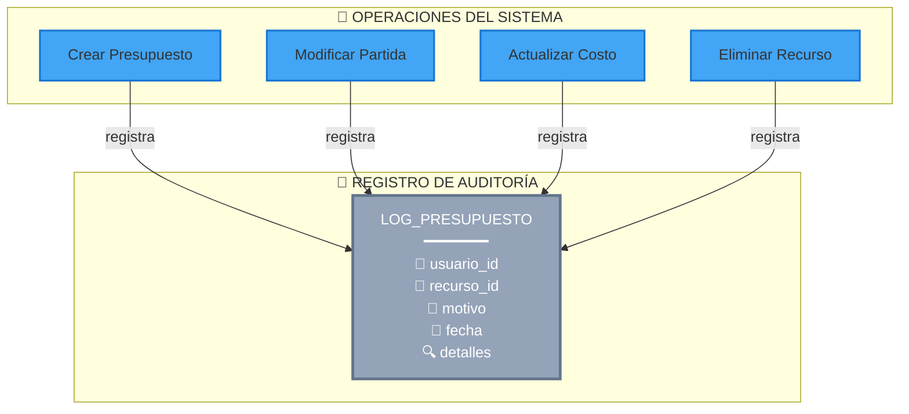

**Información Registrada:**
- 👤 **Quién**: Usuario que realizó la acción
- 🔧 **Qué**: Recurso/entidad afectada
- 📝 **Por qué**: Motivo del cambio
- 📅 **Cuándo**: Timestamp exacto
- 🔍 **Detalles**: Información adicional

---

## 📊 Estadísticas del Sistema

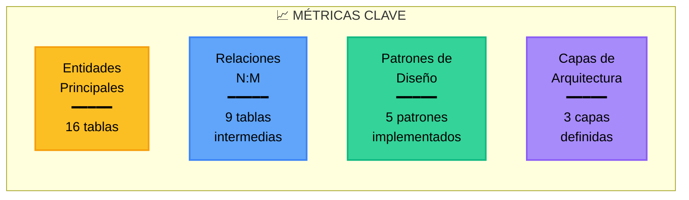

---

## 🎨 Vista de Módulos del Sistema

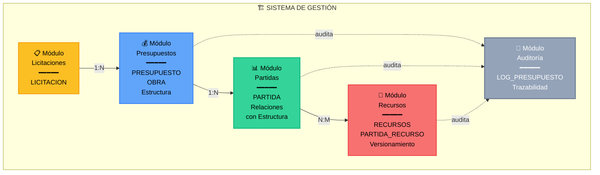

---

## ✅ Checklist de Implementación

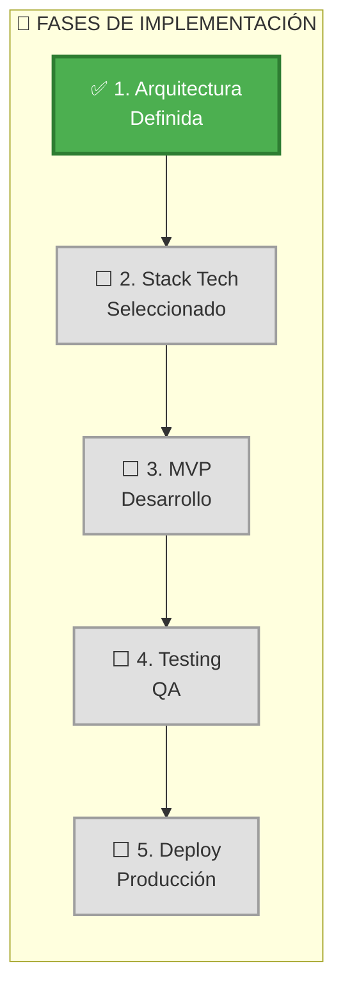

---

## 📚 Documentación Adicional

- 📘 [Guía de Implementación Completa](./guia_implementacion.md)
- 📗 [Diagramas PlantUML](./diagrama_c4_licitaciones.md)
- 📙 [README Principal](./README_GITHUB.md)

---

**🎯 ¿Siguiente paso?**  
Revisa la [Guía de Implementación](./guia_implementacion.md) para detalles técnicos completos.

---

*Documento generado con Modelo C4 - Noviembre 2025*

