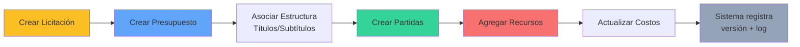

# 📊 Diagramas C4 - Sistema de Gestión de Licitaciones y Presupuestos

## 🎯 ¿Cómo visualizar estos diagramas en GitHub?

### ✅ **Opción 1: Diagramas Mermaid (Recomendado para GitHub)**
Los archivos con extensión `.md` que contienen código Mermaid **se renderizan automáticamente en GitHub**.

👉 **Archivos listos para GitHub:**
- `DIAGRAMA_VISUAL_GITHUB.md` - ¡Abre este archivo directamente en GitHub!

### ✅ **Opción 2: PlantUML con Herramientas Externas**

**Opción 2.1: Usar VS Code**
1. Instalar extensión: [PlantUML](https://marketplace.visualstudio.com/items?itemName=jebbs.plantuml)
2. Abrir archivo: `diagrama_c4_licitaciones.md`
3. Presionar `Alt + D` para preview

**Opción 2.2: Usar PlantUML Online**
1. Ir a: https://www.plantuml.com/plantuml/uml/
2. Copiar el código PlantUML del archivo
3. Pegar y visualizar

**Opción 2.3: Usar PlantText**
1. Ir a: https://www.planttext.com/
2. Copiar el código PlantUML
3. Visualizar en tiempo real

---

## 📁 Contenido del Repositorio

### 🌟 Archivos Principales para Visualización

| Archivo | Descripción | Visualización |
|---------|-------------|---------------|
| **DIAGRAMA_VISUAL_GITHUB.md** | Diagramas Mermaid optimizados | ✅ Se ve directamente en GitHub |
| **diagrama_c4_mermaid.md** | Diagramas Mermaid completos | ✅ Se ve directamente en GitHub |
| **diagrama_c4_licitaciones.md** | Diagramas PlantUML (4 niveles C4) | ⚠️ Requiere herramienta externa |
| **guia_implementacion.md** | Guía técnica completa | ✅ Documento de texto |
| **README.md** | Índice general | ✅ Documento de texto |

---

## 🚀 Quick Start - Ver Diagramas YA

### Para ver los diagramas inmediatamente en GitHub:

1. **Abre** el archivo [`DIAGRAMA_VISUAL_GITHUB.md`](./DIAGRAMA_VISUAL_GITHUB.md)
2. **GitHub renderizará** automáticamente todos los diagramas Mermaid
3. ¡Listo! 🎉

---

## 📋 Niveles del Modelo C4

El modelo C4 divide la arquitectura en 4 niveles de abstracción:

### 1️⃣ **Nivel 1 - Contexto del Sistema**
Vista de alto nivel mostrando el sistema, usuarios y sistemas externos

**Pregunta que responde:** ¿Qué hace el sistema y quién lo usa?

### 2️⃣ **Nivel 2 - Contenedores**
Aplicaciones, servicios, bases de datos que componen el sistema

**Pregunta que responde:** ¿Cuáles son las piezas principales del sistema?

### 3️⃣ **Nivel 3 - Componentes**
Componentes dentro de cada contenedor y sus relaciones

**Pregunta que responde:** ¿Cómo está organizado internamente cada servicio?

### 4️⃣ **Nivel 4 - Código** (Opcional)
Clases y detalles de implementación

**Pregunta que responde:** ¿Cómo se implementa cada componente?

---

## 🏗️ Arquitectura del Sistema (Resumen Visual)

```
┌─────────────────────────────────────────────────────────────┐
│                    USUARIOS DEL SISTEMA                      │
│  👤 Gestor de Licitaciones  │  👤 Ingeniero de Costos       │
│  👤 Auditor                  │  👤 Director de Proyecto      │
└───────────────────────┬─────────────────────────────────────┘
                        │ HTTPS
                        ▼
┌─────────────────────────────────────────────────────────────┐
│                 APLICACIÓN WEB (React.js)                    │
└───────────────────────┬─────────────────────────────────────┘
                        │ JSON/REST API
                        ▼
┌─────────────────────────────────────────────────────────────┐
│              API BACKEND (Node.js/Express)                   │
│  ┌──────────────────────────────────────────────────────┐   │
│  │  Controladores → Servicios → Repositorios           │   │
│  └──────────────────────────────────────────────────────┘   │
└───────────────────────┬─────────────────────────────────────┘
                        │
                        ▼
┌─────────────────────────────────────────────────────────────┐
│          BASE DE DATOS (PostgreSQL/MongoDB)                  │
│   Licitaciones │ Presupuestos │ Partidas │ Recursos │ Logs  │
└─────────────────────────────────────────────────────────────┘
```

---

## 💡 Conceptos Clave del Sistema

### 🔹 Sistema de Plantillas
Estructura presupuestaria reutilizable:
- **Títulos, Subtítulos y Sub-subtítulos** se crean una vez como plantillas
- Se **reutilizan** en múltiples presupuestos y partidas
- Evita duplicación y mantiene consistencia

### 🔹 Versionamiento de Costos
Control de cambios en recursos:
- Cada modificación de costo crea una **nueva versión**
- Historial completo con timestamp
- Auditoría detallada de cambios

### 🔹 Auditoría Integral
Trazabilidad completa:
- Registra **quién**, **cuándo** y **por qué** se hizo cada cambio
- Logs inmutables para compliance
- Reportes de auditoría

---

## 🎨 Módulos del Sistema

| Módulo | Entidades Principales | Descripción |
|--------|----------------------|-------------|
| **Licitaciones** | LICITACION | Gestión de licitaciones activas/inactivas |
| **Presupuestos** | PRESUPUESTO, OBRA, TITULO_*, SUBTITULO_*, SUB_SUBTITULO_* | Creación de presupuestos con estructura jerárquica |
| **Partidas** | PARTIDA, PARTIDA_TITULO, PARTIDA_SUBTITULO | Partidas presupuestarias con estructura |
| **Recursos** | RECURSOS, PARTIDA_RECURSO, PARTIDA_RECURSO_VERSION | Catálogo y versionamiento de recursos |
| **Auditoría** | LOG_PRESUPUESTO | Registro de cambios y trazabilidad |

---

## 📊 Flujo Típico de Uso



---

## 🛠️ Stack Tecnológico Recomendado

### Frontend
```
React.js 18+
Redux Toolkit / Zustand
Material-UI / Ant Design
React Hook Form + Yup
```

### Backend
```
Node.js 18+ LTS
Express.js
TypeORM / Sequelize / Mongoose
JWT + Passport.js
```

### Base de Datos
```
PostgreSQL 15+ (Recomendado)
MongoDB 6+ (Alternativa)
Redis (Cache)
```

---

## 📖 Documentación Adicional

- 📘 **Guía de Implementación Completa**: [`guia_implementacion.md`](./guia_implementacion.md)
- 📗 **Diagramas Mermaid**: [`diagrama_c4_mermaid.md`](./diagrama_c4_mermaid.md)
- 📕 **Diagramas PlantUML**: [`diagrama_c4_licitaciones.md`](./diagrama_c4_licitaciones.md)

---

## 🎯 Próximos Pasos

- [ ] Revisar y aprobar la arquitectura propuesta
- [ ] Definir stack tecnológico final
- [ ] Crear prototipos de UI/UX
- [ ] Implementar MVP (Módulo de Licitaciones + Presupuestos)
- [ ] Desarrollar sistema de autenticación
- [ ] Implementar módulos de Partidas y Recursos
- [ ] Sistema de auditoría y logs
- [ ] Testing y QA
- [ ] Deployment

---

## 🤝 Contribución

Esta arquitectura es un documento vivo. Para sugerencias o mejoras:

1. Revisar la documentación completa
2. Proponer cambios específicos
3. Validar con el equipo técnico

---

## 📞 Soporte Técnico

Para dudas sobre la arquitectura, consultar:
- **Diagramas visuales**: Usar archivos Mermaid
- **Detalles técnicos**: Ver `guia_implementacion.md`
- **Patrones de diseño**: Documentados en guía de implementación

---

**Versión**: 1.0  
**Última actualización**: Noviembre 2025  
**Modelo**: C4 (Context, Containers, Components, Code)

