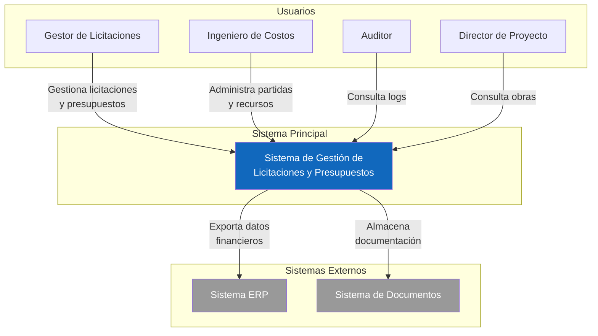
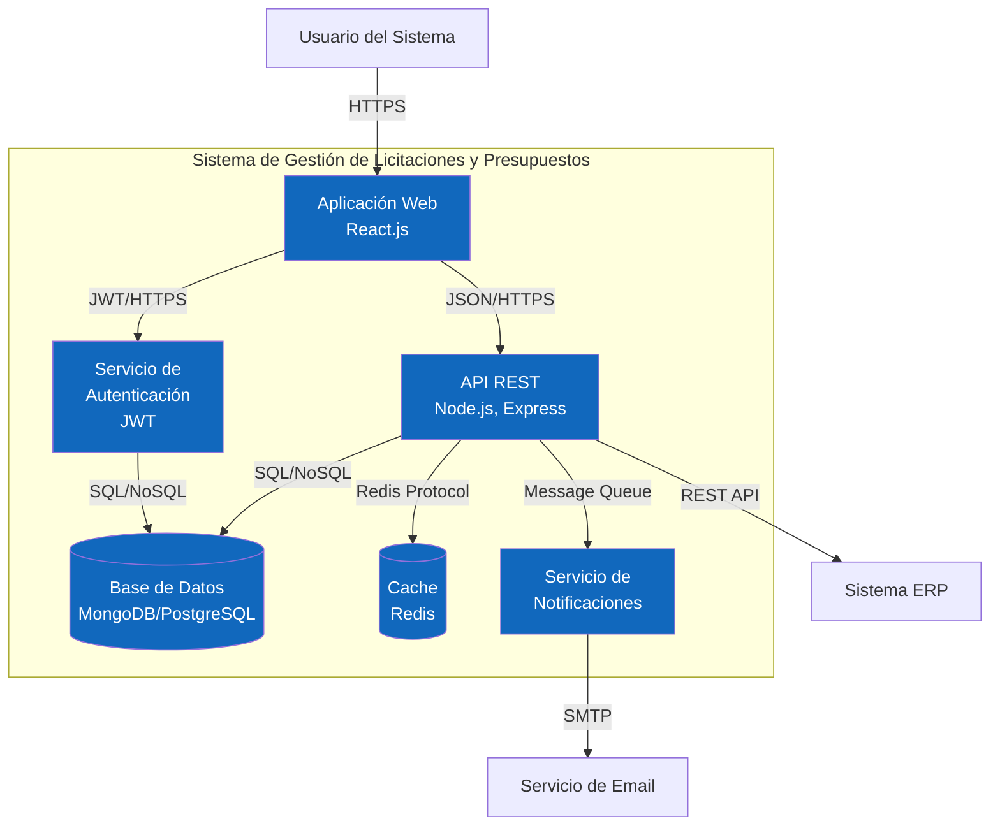
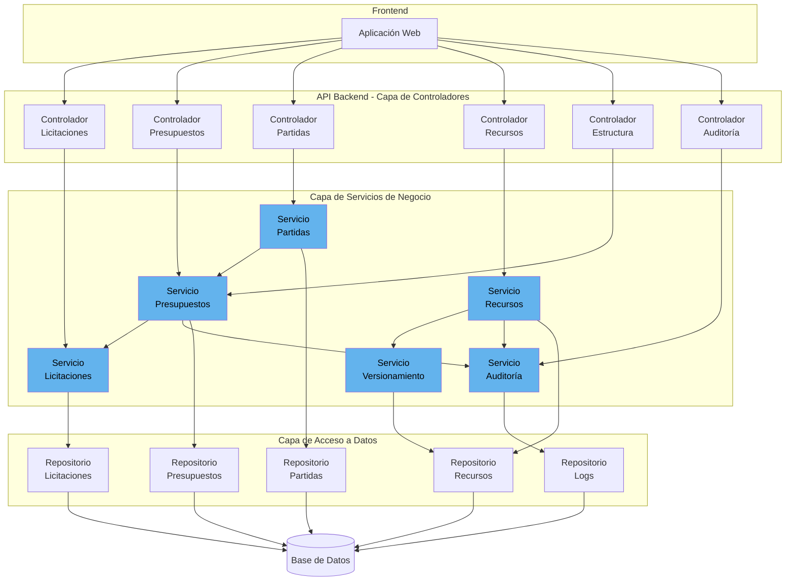
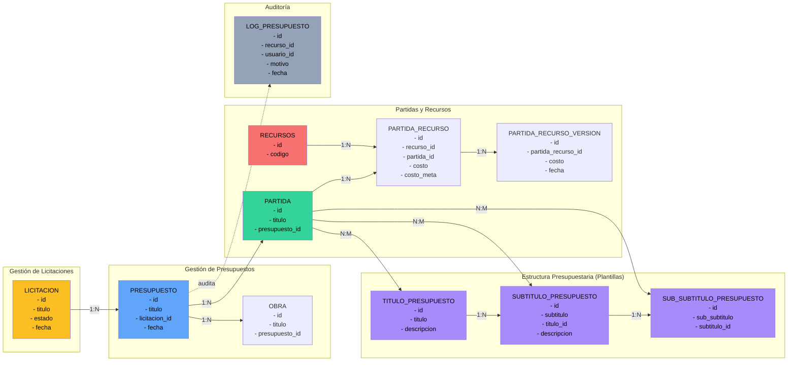
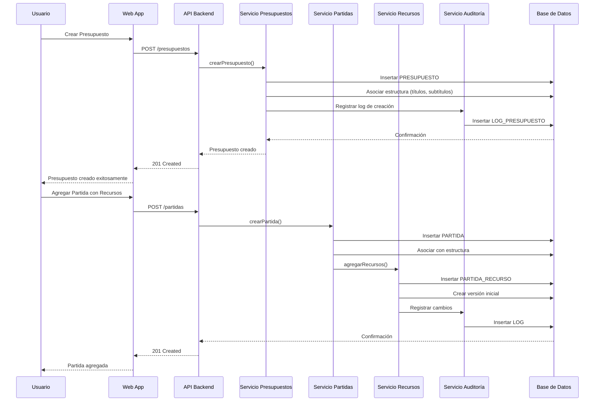

# Diagramas C4 - Versión Mermaid
Sistema de Gestión de Licitaciones y Presupuestos

## Nivel 1: Diagrama de Contexto (Simplificado)

## Nivel 2: Diagrama de Contenedores

## Nivel 3: Arquitectura de Componentes (Backend)

## Modelo de Dominio - Entidades Principales

## Flujo de Datos Principal

